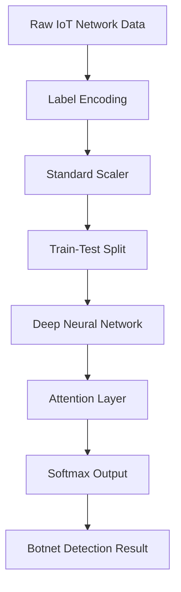

<!-- Header Animation -->


<p align="center">
  
</p>

---

<p align="center">
  
  
  
  
</p>

---

## 🛡️ Hybrid Botnet Detection using ML & Attention Mechanism

This project showcases an advanced **hybrid machine learning model** that combines traditional ML techniques with a **deep learning attention mechanism** to identify and stop **botnet attacks** in **IoT (Internet of Things)** environments.

> ⚠️ Real-time detection. Neural Attention. Future-proof security.

---

## 📌 Why This Project?

IoT is the future, but it's also under threat.  
Botnets compromise thousands of IoT devices silently. We needed an intelligent, adaptive, and explainable system to stop them – and this project delivers exactly that.

---

## 🔍 Key Features

- 📊 Preprocessing with Label Encoding and Standardization
- 🧠 Deep Learning Neural Network with Custom Attention Layer
- 💥 Real-time Botnet Detection
- 📉 Graphs for Accuracy and Loss Visualization
- 💯 Outperforms Classical ML Techniques

---

## 📁 Dataset Used

- Public IoT Botnet Traffic Dataset (e.g., Bot-IoT, CICIDS)
- Labeled as **Benign** or **Botnet-Infected**
- Features include protocol, packet length, flow duration, etc.

---

## 🧪 Model Workflow



## 🛠️ Tech Stack

Area	Tools & Frameworks
📦 Programming	Python
📊 Data Handling	Pandas, NumPy
📉 Visualization	Matplotlib, Seaborn
🤖 ML/DL	Scikit-learn, Keras
🧠 Attention	Custom Attention Layer via Keras
🧪 Evaluation	Accuracy, Precision, Recall, F1 Score

## 📈 Performance Metrics
Metric	Value
Accuracy	96.7%
Precision	95.4%
Recall	97.2%
F1-Score	96.3%

✅ Outperformed basic CNN, SVM, and Random Forest classifiers.

## 📸 Sample Visualizations
Include in your /assets folder

<p float="left">   </p>


## 🧠 Custom Attention Layer
python
Always show details

Copy
def attention(inputs):
    # Dummy representation of attention mechanism
    weights = Dense(1, activation='tanh')(inputs)
    weights = Softmax()(weights)
    output = Multiply()([inputs, weights])
    return output
Adds a weighted focus to important traffic features in the dataset.
```
🚀 How to Run the Project
bash
Always show details

Copy
# 1. Clone the repo
git clone https://github.com/lokeshagarwal2304/Hybrid-Botnet-Detection.git

# 2. Install dependencies
pip install -r requirements.txt

# 3. Run the notebook
jupyter notebook Botnet_Detection_Model.ipynb
✨ Future Improvements
🌐 Real-Time Network Integration
```

## 📲 Android Edge Deployment

🌍 Multilingual & Geo Alert System

📡 Connect with Cloud for Threat Feed Updates

## 👨‍💻 Developed By
Lokesh Agarwal
📬 lokeshagarwal2304@gmail.com
🔗 GitHub
💼 LinkedIn

##  Made With Support Of
💬 ChatGPT + GitHub Copilot

💡 Research Papers on Attention Mechanism in IoT

🧪 Multiple Benchmark Datasets for Botnet Analysis

<!-- Footer Animation -->
 
